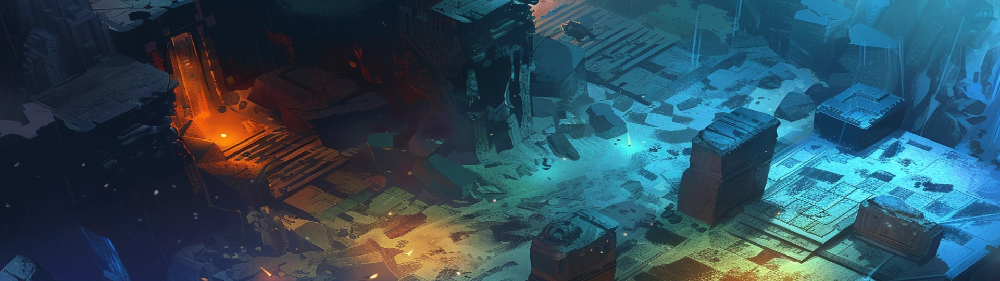

# Gameplay
[](https://github.com/critgames/gameplay)
**Actual Play for Tabletop Roleplaying Games on [critgames.com/gameplay](https://critgames.com/gameplay)**

## Watch Episodes
*Streaming live episdoes on [YouTube](http://youtube.critgames.com) and [Twitch](http://twitch.critgames.com). Join us every other week on Friday at 6:00 PM (Pacific Time).*
<br />
[](https://www.youtube.com/@CritGamesllc)
[](https://www.twitch.tv/critgamesllc)

## Local Development (Manual)
This website is made with [Jeykll](https://jekyllrb.com/) and automatically updates with commits. However, if you want to run the website for developement purposes, you can run it locally.

### Run Website Locally
```
$ bundle exec jekyll serve --force_polling
```

### Rebuild
```
$ bundle install
$ bundle exec jekyll build
```
